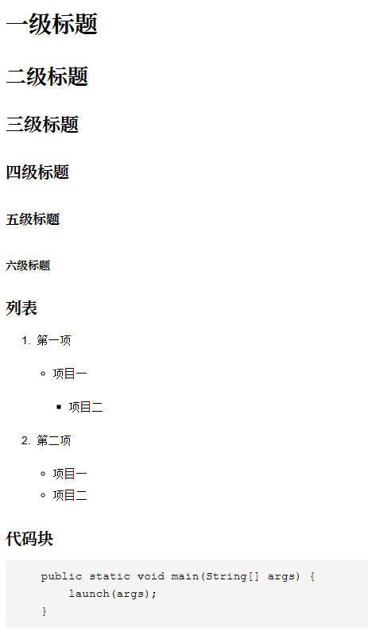

# 📝 YtyMark-java

## ✏️ 项目简介

**项目名称**：YtyMark-java

本项目是一款基于 **Java 语言** 和 **JavaFX 图形界面框架** 开发的 **Markdown 文本编辑器**。项目不仅具备 Markdown 文本编写、预览、保存、导出、等功能，还特别关注软件架构设计的优雅性与可维护性。项目采用多种经典的 **面向对象设计模式**，实现了解耦、扩展性和高可读性的代码结构。

此外，项目已 **开源**，旨在为有志于掌握设计模式、文本解析与渲染的开发者提供实战参考。

**为什么编写这个项目**

纸上得来终觉浅，绝知此事要躬行。单独学习的设计模式始终是理论的学习，实践才是经验的来源，唯有经验才属于自己的。再者，因为很少看到专门用于练手设计模式的实战项目，所以才有了`YtyMark-java`这个开源项目。该项目主要用于学习设计模式的实战项目，将所学的设计模式用于实战，在实战中领悟真谛。

---

## 📌 功能特性

- 实时 Markdown 渲染（支持标题、列表、代码块、图片等）

- 支持多tab同时编辑和渲染

- 精细化的 **撤销/重做**（单字符粒度，基于备忘录模式）

- 支持 PDF和HTML 导出

- 支持主题切换（暗黑/浅色）

- 语法解析独立模块化，可拓展

- 采用多种经典 **设计模式** 实现架构解耦与可维护性

---

## 🧠 应用的设计模式

- **组合模式**：将markdown语法解析结果构建成AST**节点树**。

- **构建者模式**：创建复杂**解析器**和**渲染器**。

- **状态模式**：对markdown文本不同语法做一些前置处理，裁剪成块级元素。

- **责任链模式**：按优先级匹配不同，在"流水线"上处理复杂的**块级元素解析**及嵌套解析。

- **策略模式**：动态选择解析器完成**行内元素的解析**和工具界面**样式的切换**。

- **迭代器模式**：通过迭代器结合递归来**遍历节点树**，比如遍历块级元素进行行内元素解析和节点树渲染操作。

- **中介者模式思想**：加入AST节点树**解耦**解析器和渲染器的耦合，使其**灵活地渲染**成不同的文档。

- **访问者模式**：负责**分离节点数据与渲染操作**，提高渲染的扩展性；在行内元素嵌套解析时使用访问者模式来解决嵌套调用问题，因为嵌套节点的文本字段是不同的。

- **工厂模式**：**样式的创建**通过工厂模式来完成。

- **观察者模式**：识别到主题发生变化时执行**重新渲染**操作；样式切换后，渲染的文字样式也需要同步调整，再结合监听器（观察者模式）来实现主题变化后重新渲染文本内容，除此之外JavaFX使用了大量的监听器。

- **装饰模式**：对自定义基础弹框做**定制化的扩展**，实现不同场景所需的弹框。

- **命令模式**：封装工具界面中的功能点及快捷键命令。

- **备忘录模式**：负责实现**撤销**和**恢复**功能，实现精细到单字符的撤销/恢复机制。

---

## 📦 项目结构

项目分为两大模块：

- UI界面（ytyedit-mark）

- markdown文本解析和渲染（ytymark）

```
YtyMark-java
├── ytyedit-mark/
│   ├── src/
│   │   ├── main/
│   │   │   ├── java/
│   │   │   │   ├── editor/             # JavaFX UI 界面
│   │   │   │   ├── enums/              # Icon图标等
│   │   │   │   ├── utils/              # 资源读取等
│   │   │   │   ├── window/             # 自定义窗口（主窗口、弹框）
│   │   │   │   ├── RenderMarkdown      # 解析和渲染
│   │   │   │   ├── YtyEditApplication  # 主程序入口
│   │   │   └── resources/
│   │   │       └── css/                # 主题样式（CSS）
│   │   │       └── fonts/              # 字体集
│   │   │       └── images/             # 图片
│   ├── README.md
│   └── pom.xml
│
├── ytymark/
│   ├── src/
│   │   ├── main/
│   │   │   ├── java/
│   │   │   │   ├── annotation/         # 自定义注解
│   │   │   │   ├── enums/              # 枚举值
│   │   │   │   ├── node/               # 树节点（块级和行级节点）
│   │   │   │   ├── parser/             # 解析器（块级和行级元素）
│   │   │   │   ├── renderer/           # 渲染器（块级和行级元素）
│   │   │   └── resources/
│   │   │       └── 
│   ├── README.md
│   └──pom.xml
├── pom.xml
└── README.md
```

### 文本处理流程图


---

## 🚀 快速开始

### 克隆项目

```bash
git clone https://github.com/yuantingyue/YtyMark-java.git
```

### 🛠️运行项目（使用 Maven）

```bash
mvn clean install 
mvn -pl ytyedit-mark exec:java
```

或使用 IDE（IntelliJ IDEA / Eclipse）打开项目，并运行主类；

也可以打包成jar，然后启动：

```java
java -jar ytyedit-mark-0.0.1.jar
```

---

## 📸 截图预览

### 白天模式的截图：


### 夜间模式的截图：


### 支持的语法截图：




---

## 📚 示例代码片段

```java
// ytymark模块，对Markdown 文本解析和渲染，测试类中也有相关代码。

Parser parser = ParserBuilder.builder().build();
Renderer renderer = RendererBuilder.builder().build(HtmlRenderer.class);
Node root = parser.parse(markdown);
String html = renderer.processRender(root);
System.out.println(html);

```

---

## 📄 License

本项目基于 GNU GPL v3 许可协议开源，欢迎自由使用，保持开源思想。

---

## 🙌 致谢

欢迎支持 Star ⭐️！
你也可以在 Issues 区提出你的建议或想法！

---

📬 **开发者**：渊渟岳（YTY）
📫 **支持作者**：关注微信公众号：java全栈布道师


