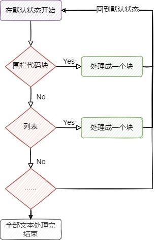
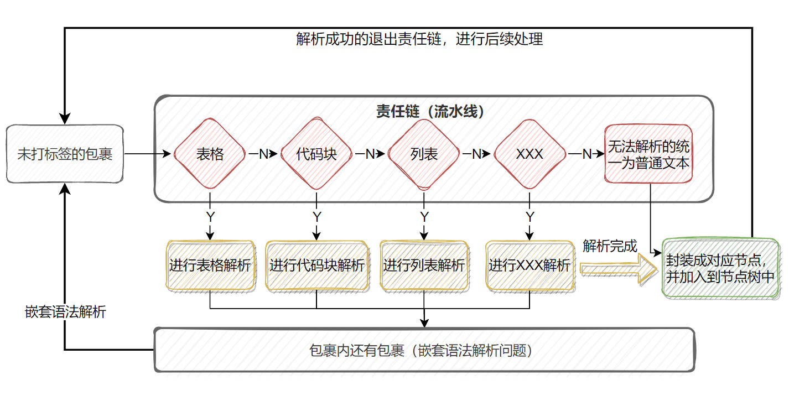
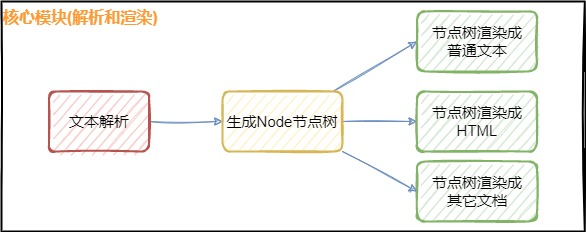
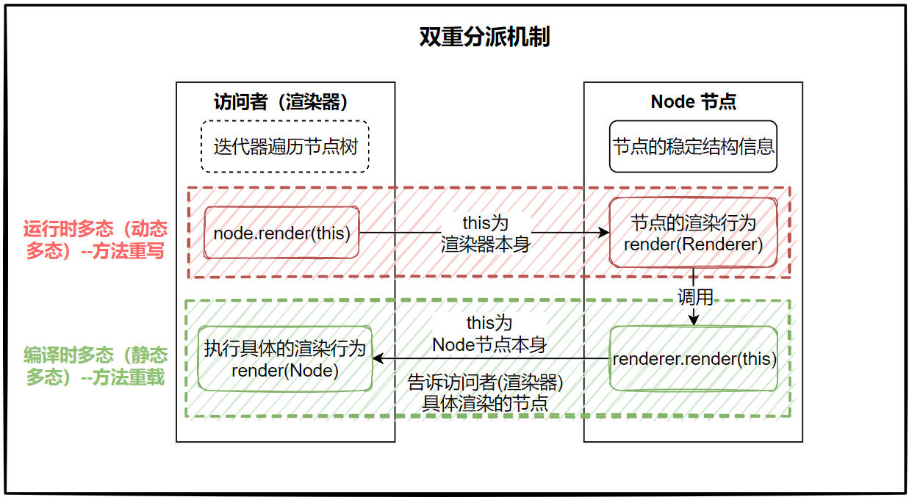

## 说明文档目录

> [项目介绍](../README.md)
>
> [1：项目的整体总结](./1：项目的整体总结.md)
>
> [2：核心功能（解析和渲染）](./2：核心功能（解析和渲染）.md)
>
> [3：界面UI相关功能](./3：界面UI相关功能.md)

## 📌1. 简述

YtyMark-java项目分为两大模块：

- UI界面（ytyedit-mark）

- markdown文本解析和渲染（ytymark）

本文主要内容为**核心模块--markdown文本解析和渲染**。

关于markdown文本解析器怎么设计，渲染器怎么实现，怎么解耦解析和渲染。在这整个流程中，如果通过设计模式实现高内聚低耦合，可重用，易于阅读，易于扩展，易于维护等。

该模块的主要目录结构：

```markdown
YtyMark-java
├── ytymark/
│ ├── src/
│ │ ├── main/
│ │ │ ├── java/
│ │ │ │ ├── annotation/    # 自定义注解
│ │ │ │ ├── enums/         # 枚举值
│ │ │ │ ├── node/          # 树节点
│ │ │ │ │   ├── block/         # 块级节点
│ │ │ │ │   ├── inline/        # 行级节点
│ │ │ │ │   ├── Aggregate      # 聚合接口
│ │ │ │ │   ├── Iterator       # 迭代器接口
│ │ │ │ │   ├── Node           # 节点抽象类
│ │ │ │ │   └── NodeIterator   # 节点迭代器
│ │ │ │ ├── parser/        # 解析器
│ │ │ │ │   ├── block/         # 块级节点解析器
│ │ │ │ │   ├── builder/       # 解析器构建器
│ │ │ │ │   ├── inline/        # 行级节点解析器
│ │ │ │ │   ├── ...
│ │ │ │ └── renderer/      # 渲染器（块级和行级元素）
│ │ │ └── resources/
│ ├── README.md
│ └──pom.xml
```

## 🧩2.解析器

**目标**：将 Markdown 文本解析为节点树。

**使用到的设计模式**：

- **构建者模式**：创建复杂**解析器**和**渲染器**。

- **状态模式**：对markdown文本不同语法做一些前置处理，裁剪成块级元素。

- **责任链模式**：按优先级匹配不同，处理复杂的**块级元素解析**及嵌套解析。

- **策略模式**：动态选择解析器完成**行内元素的解析**。

- **组合模式**：表示 Markdown 语法结构（如段落、标题、列表）之间的树形结构。

- **迭代器模式**：通过迭代器结合递归来**遍历节点树**，遍历块级元素进行行内元素解析。

根据使用顺序逐一讲述。

### 2.1. 构建者模式

通过构建者模式来创建复杂的**解析器**和**渲染器**，包括**自定义解析器**的加入。

最简单的解析器（默认支持的语法解析器）和HTML渲染器

```java
// 构建解析器
Parser parser = ParserBuilder.builder().build();
// 构建渲染器
Renderer renderer = RendererBuilder.builder().build(HtmlRenderer.class);
```

加入自定义块级元素解析器或者行级元素的解析器：

```java
Parser parser = ParserBuilder.builder()
                .addDelimiter("_")
                .addBlockParser(new ParagraphParserHandler())
                .addInlineParser("_", new ItalicParser())
                .build();
```

除此之外，程序会在启动时，扫描`org.ytymark.parser`包中带有注解`BlockParserHandlerType`的类，所以还可以通过注解加入新的块级元素解析器。

比如表格解析器：只需要在块解析器类上面加入这个注解和对应的枚举类即可

```java
// 枚举类
public enum BlockParserHandlerEnum {
    TABLE("TABLE",6),
// 通过注解加入块级元素解析器
@BlockParserHandlerType(type = BlockParserHandlerEnum.TABLE)
public class TableParserHandler extends AbstractBlockParser implements ParserHandler {
```

### 2.2. 状态模式

对markdown文本不同语法做一些前置处理，裁剪成块级元素。

在正式进行块级元素解析前，对原始markdown文本进行分割，**分割成一块**一块的。

由于markdown语法很多，不进行一些设计，那将是一坨难以阅读理解、难以维护和扩展的代码。

通过状态模式实现类似状态机的机制，当状态（语法）匹配时，自动流转到专门处理这个语法的程序，处理完之后分割成一个“块”（这个块就是一个块元素），再回到默认状态，然后继续处理后续的文本。具体代码位于：`org.ytymark.parser.block.state`包。



### 2.3. 责任链模式

按优先级匹配不同，处理复杂的**块级元素解析**及嵌套解析。

在正式进行块级元素解析前，状态模式将元素文本处理成**块数据集合**，这就像流水线上简单的打了包，但并不区分包裹里面是什么内容。接着将这些包裹丢上流水线（责任链）上，责任链根据程序初始化时定好的顺序，逐一检测包裹里的内容是什么，匹配得上的就直接丢给机器处理（解析），最终给包裹打上标签（包装成节点对象）。对应包裹里还有包裹的，便继续丢回流水线上进行打标签。

整个处理流程，如图：



块解析的代码

```java
    public void parser(String text, Node node) {
        List<String> blocks = this.splitBlock(text);

        // 逐块处理文本
        for (String block : blocks) {
            blockParserChain.parser(block, node);
        }

    }
```

### 2.4. 策略模式

动态选择解析器完成**行级元素的解析**。

块级元素解析完成后，会形成块节点的节点树，再进行**行级元素解析**。

```java
public Node parse(String markdownText) {
        Node root = new DocumentNode();
        // 统一换行符，替换所有 \r\n 或 \r 为 \n
        String normalizedText = markdownText.replaceAll("\r\n|\r", "\n");

        // 块级元素解析
        blockParserContext.parser(normalizedText, root);

        // 行级元素解析
        this.parseInlines(root);

        return root;
    }
```

行级元素并不是所有块元素都需要进行处理，目前**只对标题和段落块节点进行解析**，因为其它块级元素的内容最终会通过段落节点进行保存。

根据语法特点，动态选择解析器完成**行级元素的解析**，关键代码如下：

```java
// 检查字符对或单个字符，选择对应的解析器
String possibleDelimiter = this.getPossibleDelimiter(line, i);
InlineParser inlineParser = inlineParserMap.get(possibleDelimiter);

if (inlineParser != null) {
    // 找到合适地解析器，尝试解析
    InlineNode inlineNode = inlineParser.parser(sourceLine, this);
    if(inlineNode!=null){
        node.addChildNode(inlineNode);
    }
}
```

### 2.5. 组合模式和迭代器模式

表示 Markdown 语法结构（如段落、标题、列表）之间的树形结构，每个语法对应一个`Node`节点，在块级元素和行级元素的解析过程，最终组合成节点树。节点和迭代器源码位于`org.ytymark.node`包。

通过迭代器结合递归来**遍历节点树**，在解析阶段，用于遍历块级元素进行行内元素解析。

使用迭代器完成兄弟节点的遍历（广度遍历），再结合递归完成子节点遍历（深度遍历），具体源码如下：

```java
/**
 * 行级元素解析
 * @param parent 父节点
 */
@Override
public void parseInlines(Node parent) {
    Iterator<Node> iterator = parent.createIterator();
    while (iterator.hasNext()) {
        // 获取下一个兄弟节点
        Node node = iterator.next();
        // 解析子节点行
        if(node instanceof ParagraphNode){
            inlineParserContext.parser(((ParagraphNode) node).getText(),node);
        }
        if(node instanceof HeadingNode) {
            inlineParserContext.parser(((HeadingNode) node).getText(), node);
        }

        if(node.getFirstChild()!=null)
            parseInlines(node);
    }
}
```

## 🗂3. 渲染器

**目标**：将 AST 语法树渲染为 HTML 文本预览。

**使用到的设计模式**：

- **中介者模式思想**：加入AST节点树**解耦**解析器和渲染器，使其**灵活地渲染**成不同的文档。

- **迭代器模式**：通过迭代器结合递归来**遍历节点树**，比如遍历节点树完成渲染操作。

- **访问者模式**：负责**分离节点数据与渲染操作**，提高渲染的扩展性。

### 3.1. 中介者模式思想

在解析和渲染中间加入AST节点树，**解耦**解析器和渲染器，使得一次解析可以**灵活地渲染**成不同的文档。为了将低耦合，常常会在两者间多加一层。



### 3.2. 迭代器模式

通过迭代器结合递归来**遍历节点树**，在渲染阶段，遍历节点树完成渲染操作。

```java
/**
 * 循环渲染兄弟节点
 *    在实现这个抽象类的渲染器中，如果存在子节点行为就需要调用这个方法实现递归遍历子节点
 */
protected void renderChildren(Node parent) {
    Iterator<Node> iterator = parent.createIterator();
    while (iterator.hasNext()) {
        // 获取下一个兄弟节点
        Node next = iterator.next();
        // 渲染节点
        next.render(this);
    }
}
```

### 3.3. 访问者模式

负责**分离Node节点数据与渲染操作行为**，提高渲染的扩展性。在每个节点类中，实现渲染逻辑时只需要编写以下代码：

```java
@Override
public void render(Renderer renderer) {
    renderer.render(this);
}
```

将渲染逻辑抽离出来，由渲染器接口实现类来**实现具体的渲染逻辑**，不同的实现类对应不同的渲染行为，目前只实现了HTML的渲染。
在构建器中选择渲染器类型：

```java
Renderer renderer = RendererBuilder.builder().build(HtmlRenderer.class);
```

**解决渲染的扩展性（多样性）问题**

如果需要将markdown文本渲染成**普通文本**，则只需要继承`AbstractRenderer` 抽象类，实现`Renderer`接口中所有方法即可。并且实现渲染逻辑非常简单，只需要关注当前节点要做的事情即可。

比如，表格最外层的渲染源码

```java
@Override
public void render(TableNode tableNode) {
    sbHTML.append("<table>\n");
    renderChildren(tableNode);
    sbHTML.append("</table>\n");
}
```

而兄弟节点（广度遍历）和嵌套子节点（深度遍历），只需要调用抽象类`AbstractRenderer`的 `renderChildren(Node parent)`方法即可完成渲染，使得渲染逻辑只需要关注当前节点的行为即可。比如上面的表格渲染代码`renderChildren(tableNode);`。



## 🚀4. 项目亮点

- 💡 **高度模块化**，任何 Markdown 语法都能独立添加/修改。

- 🧠 **设计模式实战**，适合做设计模式学习的项目。

- 🖥️ **可按需获取**，用户界面和文本解析渲染分为两个模块
  
  - 只使用用户界面源码，然后轻松切换成熟的解析器依赖，开发一个完整的markdown文本编辑器；
  
  - 仅学习文本解析渲染模块源码，不用关注用户界面源码。

- 🧪 **解析性能毫秒级**，确保解析效率。

- 🎯 **轻松上手**，使用JDK8 自带JavaFX模块，无需做额外处理。

- 📦 **开源项目，文档完善**，方便学习和贡献。

## ✏️5. 总结

markdown 文本解析和渲染将多种设计模式融入到实际应用中，是一次系统性的 **设计模式实践**或**架构设计实践**。
